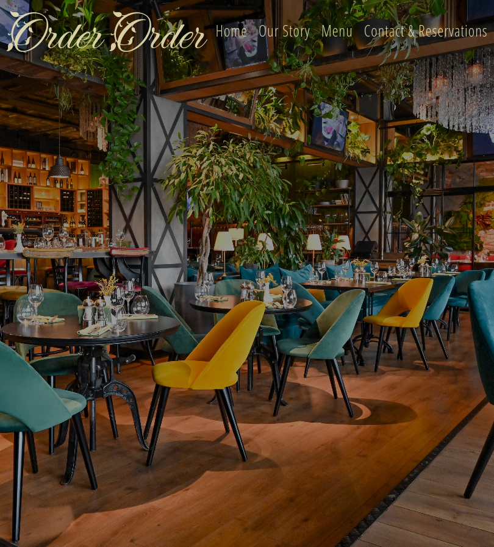

# Order Order- Restaurant Landing Page

## About The Project
Order Order is a ficticious restaurant landing page built after I completed the General Assembly Front-End Web Development Bootcamp. This was the first project I built on my own and it took me about three weeks to complete. Through this project, I was able to use the skills I aquired during the bootcamp and enhance my JavaScript knowledge. On the landing page, I wanted users to be able to toggle through different menus, for that I had to do more research into JavaScript to figure out how to make it all work properly.

### Built With
* HTML
* CSS
* JavaScript
* Bootstrap

## Acknowledgements
* [W3 Schools](https://www.w3schools.com/)
* [Font Awesome](https://fontawesome.com/)
* [Google Fonts](https://fonts.google.com/)
* [Pexels- free stock photos](https://www.pexels.com/)

## Author
- Kendra Ward - [@KNWard](https://github.com/KNWard)